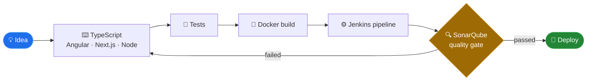

<h1 align="center">Hi, I'm Sithum Raigamage 👋</h1>

  Associate Software Engineer <a href="https://github.com/Wavenet">@Wavenet</a> · Software Engineering undergrad at IIT Sri Lanka 
  Building full-stack products and the pipelines that ship them. 📍 Sri Lanka

  

  
  
  

---

## 💫 About Me

- 🏢 **Associate Software Engineer at Wavenet**, while finishing my degree at **IIT Sri Lanka**
- 🔭 Currently on my **final year project** and a Next.js 15 intranet portal
- 🌱 Going deep on **DevOps** — CI/CD, containers, code quality gates — and moving into **AI-assisted development and LLM app building**
- ⚙️ Most at home across **TypeScript, Angular/React/Next.js, Node.js, and Jenkins pipelines**
- 📱 Weekend side quest: **SwiftUI** iOS apps
- 👯 Open to collaborating on frontend and backend projects
- 🤝 Always up for a conversation about **project architecture and clean code practices**
- 💬 Ask me about my internship experience or my favourite side projects

---

## 🛠️ Tech Stack

**Languages**

**Frontend**

**Backend & Data**

**DevOps & Tooling**

---

## 🌱 Currently Exploring

> Not claiming these yet — this is my 2026 learning track.

Building LLM-backed features (RAG, tool-calling, MCP), infrastructure as code, and getting my pipelines observable rather than just green.

---

## 🔄 How I Ship

Rendered natively by GitHub — no external service, no rate limits.

---

## 🚀 Featured Projects

| Project | What it is | Stack |
| --- | --- | --- |
| [**Expense Tracker**](https://github.com/SithumRaigamage/expense-tracker) | Full-stack expense tracker with a complete CI/CD pipeline and quality gates | Angular · Node.js · MongoDB · Docker · Jenkins · SonarQube |
| [**LankaTechConnect**](https://github.com/SithumRaigamage/LankaTechConnect) | Open-source IT professional directory for Sri Lanka's tech community | React · Express · MongoDB |
| [**FileFlow**](https://github.com/SithumRaigamage/file-manager) | Desktop file manager with a smart organizer, bulk renamer, and converter | Electron · TypeScript |
| [**JobTrigger**](https://github.com/SithumRaigamage/JobTrigger) | iOS app to trigger and monitor Jenkins builds remotely | Swift · SwiftUI · Node.js · JWT |
| [**Blogs**](https://github.com/SithumRaigamage/Blogs) | Dev blog & knowledge base with a 3D knowledge graph and learning paths | Astro · TypeScript |
| [**performanceStats**](https://github.com/SithumRaigamage/performanceStats) | Real-time macOS system monitor — CPU, memory, disk, and network | Next.js · Node.js |

More projects

- [**pcshop**](https://github.com/SithumRaigamage/pcshop) — PC hardware e-commerce store · React, Vite, TypeScript, shadcn/ui
- [**ShopPeek**](https://github.com/SithumRaigamage/ShopPeek) — SwiftUI shopping app with cart, favourites, and search
- [**CatBreedExplorer**](https://github.com/SithumRaigamage/CatBreedExplorer) — Browse cat breeds with photos and traits, via The Cat API
- [**TaskBoard**](https://github.com/SithumRaigamage/TaskBoard) — SwiftUI task manager with filtering and progress tracking
- [**QuoteViewer**](https://github.com/SithumRaigamage/QuoteViewer) — Discover, like, and share quotes · SwiftUI
- [**Users-iOS**](https://github.com/SithumRaigamage/Users-iOS) — Browse user profiles from a REST API · SwiftUI
- [**Demon Slayer**](https://github.com/SithumRaigamage/Demon-Slayer) — API-driven fan site · HTML, CSS, JavaScript

---

<!-- TODO: fill in certifications, or delete this whole section
## 🏅 Certifications

- Certification Name — Issuer, Year
-->

## 📊 GitHub Stats

  
  

  

  
  

  

📈 Commit stats & when I actually code

  
  

---

## 🐍 Watch my contributions get eaten

  <picture>
    <source media="(prefers-color-scheme: dark)" srcset="https://raw.githubusercontent.com/SithumRaigamage/SithumRaigamage/output/github-snake-dark.svg"/>
    <source media="(prefers-color-scheme: light)" srcset="https://raw.githubusercontent.com/SithumRaigamage/SithumRaigamage/output/github-snake.svg"/>
    
  </picture>

---

  

